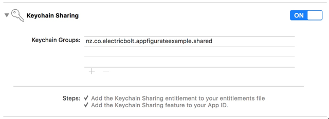

# Advanced configuration

## Application startup

### iOS apps

Appfigurate performs method swizzling on `UIApplicationDelegate` to automatically invoke `APLApplicationDidFinishLaunchingWithOptions()`. Developers who prefer not to use swizzling must do the following:

- Add the Boolean `APLInstallDelegateMethods=NO` in your app's Info.plist file.
- Call `APLApplicationDidFinishLaunchingWithOptions()` in your app's delegate `application:didFinishLaunchingWithOptions:` method.
- Call `APLApplicationOpenURL()` in your app's delegate `application:openURL:sourceApplication:annotation:` method (OS8) or `application:openURL:options:` method (OS9+).

> Objective-C example

```objc
#import "Appfigurate.h"

@implementation AppDelegate

- (BOOL) application:(UIApplication *)application openURL:(NSURL *)url sourceApplication:(NSString *)sourceApplication annotation:(id)annotation {
    if (APLApplicationOpenURL(url) == YES) {
        return YES;
    }
    return NO;
}

- (BOOL)application:(UIApplication *)application didFinishLaunchingWithOptions:(NSDictionary *)launchOptions {
    APLApplicationDidFinishLaunchingWithOptions(launchOptions);
    return YES;
}

@end
```

> Swift example

```swift
@UIApplicationMain class AppDelegate: UIResponder, UIApplicationDelegate {

    var window: UIWindow?

    func application(_ application: UIApplication, open url: URL, sourceApplication: String?, annotation: Any) -> Bool {
        if APLApplicationOpenURL(url) {
            return true
        }
        return false
    }

    func application(_ application: UIApplication, didFinishLaunchingWithOptions launchOptions: [UIApplicationLaunchOptionsKey: Any]?) -> Bool {
        APLApplicationDidFinishLaunchingWithOptions(launchOptions)
        return true
    }

}
```

### iOS app extensions

iOS app extensions don't have any additional startup requirements.

### watchOS apps

Appfigurate performs method swizzling on `WKExtensionDelegate` to automatically invoke `APLApplicationDidFinishLaunching()`. Developers who prefer not to use swizzling must do the following:

- Add the Boolean `APLInstallDelegateMethods=NO` in your extension's Info.plist file.
- Call `APLApplicationDidFinishLaunching()` in your extension's delegate
  `applicationDidFinishLaunching` method.
  
> Objective-C example

```objc
#import "Appfigurate.h"

@implementation ExtensionDelegate

- (void) applicationDidFinishLaunching {
    APLApplicationDidFinishLaunching();
}

@end
```

> Swift example

```swift
class ExtensionDelegate: WKExtensionDelegate {

    func applicationDidFinishLaunching {
        APLApplicationDidFinishLaunching()
    }

}
```

## Info.plist configuration

#### APLInstallDelegateMethods (optional)

Appfigurate performs method swizzling on `UIApplicationDelegate` and `WKExtensionDelegate` to automatically invoke the appropriate methods (e.g. `APLApplicationDidFinishLaunching()` and `APLApplicationOpenURL()`). Developers who prefer not to use swizzling must add the
`APLInstallDelegateMethods` key to the App's Info.plist file.

> Info.plist example

```xml
<?xml version="1.0" encoding="UTF-8"?>
<!DOCTYPE plist PUBLIC "-//Apple//DTD PLIST 1.0//EN" "http://www.apple.com/DTDs/PropertyList-1.0.dtd">
<plist version="1.0">
<dict>
     <key>APLInstallDelegateMethods</key>
     <false/>
     ...
```

The default value of `APLInstallDelegateMethods` is true.

See also `APLApplicationDidFinishLaunching()`

#### APLLogging (optional)

To enable debug logging in the Appfigurate library early on, add the `APLLogging` key to the App's Info.plist file.

> Info.plist example

```xml
<?xml version="1.0" encoding="UTF-8"?>
<!DOCTYPE plist PUBLIC "-//Apple//DTD PLIST 1.0//EN" "http://www.apple.com/DTDs/PropertyList-1.0.dtd">
<plist version="1.0">
<dict>
     <key>APLLogging</key>
     <true/>
     ...
```

The default value of `APLLogging` is false. You should not need to enable this to true unless you are having trouble integrating the library. It is best practice not to ship an app with this key set to true.

You can also call `APLSetLogging()` method to achieve the same result in code.

#### APLKeychainAccessibility (optional)

The `APLKeychainAccessibility` key affects the access level of any configuration data stored in the keychain. Best practice is to use the most restrictive option that is compatible with your app and extension.

Value                | Description
---------------------|-----------------------------------------
WhenUnlocked | Configuration can only be accessed while the device is unlocked. Will migrate to a new device when restored from an encrypted backup.
AfterFirstUnlock | Configuration can only be accessed once the device has been unlocked after a restart. Will migrate to a new device when restored from an encrypted backup.
Always | Configuration can always be accessed regardless of the lock state of the device. Will migrate to a new device when restored from an encrypted backup.
WhenPasscodeSetThisDeviceOnly | Configuration can only be accessed while the device is unlocked.
WhenUnlockedThisDeviceOnly | Configuration can only be accessed while the device is unlocked.
AfterFirstUnlockThisDeviceOnly | Configuration can only be accessed once the device has been unlocked after a restart.
AlwaysThisDeviceOnly | Configuration can always be accessed regardless of the lock state of the device.

> Info.plist example

```xml
<?xml version="1.0" encoding="UTF-8"?>
<!DOCTYPE plist PUBLIC "-//Apple//DTD PLIST 1.0//EN" "http://www.apple.com/DTDs/PropertyList-1.0.dtd">
<plist version="1.0">
<dict>
     <key>APLKeychainAccessibility</key>
     <string>AfterFirstUnlock</string>
     ...
```

The default value of `APLKeychainAccessibility` is `Always`.

#### APLKeychainAccessGroup (optional)

In order to share configuration between an app and an app extension, Keychain Sharing must be enabled in the app's and app extensions' Capabilities tab.



The `APLKeychainAccessGroup` key must contain the same value as the Keychain Groups value.

> Info.plist example

```xml
<?xml version="1.0" encoding="UTF-8"?>
<!DOCTYPE plist PUBLIC "-//Apple//DTD PLIST 1.0//EN" "http://www.apple.com/DTDs/PropertyList-1.0.dtd">
<plist version="1.0">
<dict>
     <key>APLKeychainAccessGroup</key>
     <string>nz.co.electricbolt.appfigurateexample.shared</string>
     ...
```

If the `APLKeychainAccessGroup` key is not defined, then keychain access group functionality is not used. Do not specify an empty or otherwise invalid `APLKeychainAccessGroup` value.
 
### Key availability by platform

Key                                  | iOS app | iOS app extension | watchOS app
----------------------------------------|---------|-------------------|--------------
APLInstallDelegateMethods | ✓ | 1 | ✓
APLLogging | ✓ | 1 | ✓
APLKeychainAccessibility | ✓ | 1 | ✓
APLKeychainAccessGroup | ✓ | 1 | 2

1=iOS app extensions automatically use the Info.plist file from the containing app - you do not need to modify the iOS app extension's Info.plist file.

2=available soon

## WCSession

If your watch app already has a `WCSessionDelegate`, then call the `APLSessionDidReceiveMessage()` method as follows to allow Appfigurate library to receive configuration data from the Appfigurate app on the paired iPhone.

> Objective-C example
 
```objc
- (void) session: (WCSession*) session didReceiveMessage: (NSDictionary<NSString*,id>*) message
    replyHandler: (void (^)(NSDictionary<NSString*,id>*)) replyHandler {
    NSDictionary* reply = APLSessionDidReceiveMessage(message);
    if (reply != nil)
        replyHandler(reply);
    else
        ...
```

> Swift example

```swift
func session(_ session: WCSession, didReceiveMessage message: [String : Any], replyHandler: @escaping ([String : Any]) -> Void) {
	let reply = APLSessionDidReceiveMessage(message)
	if reply != nil
		replyHandler(reply)
	else
	    ...
```
If your watch app does not use `WCSessionDelegate` then a default implementation is provided.

## Standard Info.plist behaviour

#### CFBundleDisplayName

The standard key `CFBundleDisplayName` (if specified) will be used to populate the name of the app in Appfigurate. If not specified, then the `CFBundleName` value is used.

#### CFBundleShortVersionString

The standard key `CFBundleShortVersionString` (if specified) will be used to populate the version of the app in Appfigurate. If not specified, then the `CFBundleVersion` value is used.

#### CFBundleIcons

To populate the icon of the app in Appfigurate, the following search order is used: `CFBundleIcons`,`CFBundleIconFiles`,`CFBundleIconFile`.

For iOS, the search order of app icon sizes is: 60x60@2x, 60x60@3x, 76x76@2x, 83.5x83.5@2x, 60x60@1x, 76x76@1x

For watchOS, the search order of app icon sizes is: 40x40@2x
