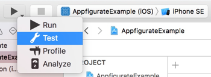
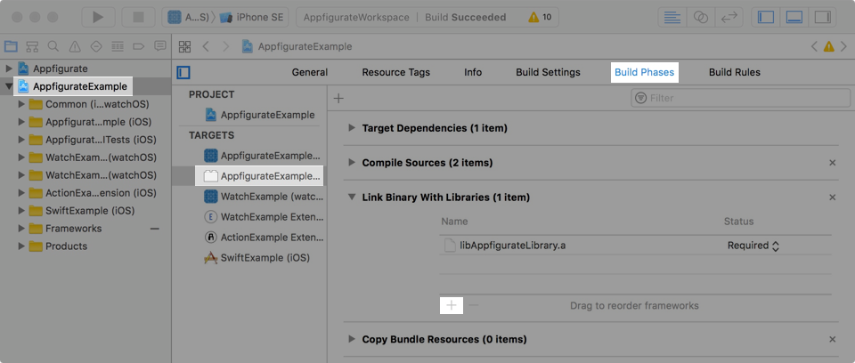
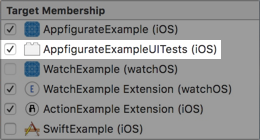

# Automation testing configuration

Appfigurate can change the configuration of an iOS app being automation tested using XCTestCase.

An example UI testing bundle `AppfigurateExampleUITests` is available in `AppfigurateExample`. To test, ensure `AppfigurateExample (iOS)` is selected as the scheme, then long tap the run button to show more options and tap `Test` (⌘U).



### Step 1. Add libAppfigurateLibrary.a to UI testing bundle

* Select your project `AppfigurateExampleUITests ` in the project navigator.
* Select your target `AppfigurateExampleUITests ` in the project/targets pane.
* Select `Build Phases` tab
* Expand section `Link Binary with Libraries`.
* Tap `+` button
* On the `Choose frameworks and libaries to add` dialog, tap the `Add Other...` button.
* Navigate to the cloned Appfigurate repository and select `AppfigurateLibrary/libAppfigurateLibrary.a`



### Step 2. Add APLConfiguration subclass to UI testing bundle

* Select your `APLConfiguration` subclass `ExampleConfiguration.m` in the project navigator.
* In the Target Membership of the utilities area, tick on `AppfigurateExampleUITests`



This allow the UI Testing bundle to gain access to your APLConfiguration subclass.

### Step 3. Ensure allowInvalidSignatures returns YES

In your `APLConfiguration` subclass, ensure that your `allowInvalidSignatures` method returns `YES` when running automation tests. Check `AppfigurateLibrary/Appfigurate.h` for default implementation details. (`Test` schemes are by default run with a `Debug` build).

### Step 4. Add a UIInterruptionMonitor

When the configuration is applied to the application on launch, the standard Appfigurate 'Configuration applied' alert is displayed. You can optionally add an UIInterruptionMonitor to your XCTestCase to automatically dismiss this alert.

> Objective-C example

```objective-c
[self addUIInterruptionMonitorWithDescription: @"Appfigurate" handler: ^(XCUIElement *alert) {
  [alert.buttons[@"OK"] tap];
  return YES;
}];
```

> Swift example

```swift
addUIInterruptionMonitor(withDescription: "Appfigurate") { alert -> Bool in
  alert.buttons["OK"].tap()
  return true
}
```

### Step 5. Create instance of APLConfiguration subclass

* Create an instance of your APLConfiguration subclass in your XCTestCase. A good place to do this in the setUp method.
* Set the properties required to be applied to your app to allow it to be tested correctly.

> Objective-C example

```objective-c
ExampleConfiguration* c = [ExampleConfiguration new];
c.boolean = NO;
c.string_Textfield = @"thursday";
```

> Swift example

```swift
let c = ExampleConfiguration()
c.boolean = false
c.string_Textfield = "thursday"
```

### Step 6. Apply configuration to XCUIApplication

* Apply the result of APLConfiguration's automationLaunchArguments method to XCUIApplication's launchArguments property.
* Launch your app.

> Objective-C example

```objective-c
app = [XCUIApplication new];
app.launchArguments = [c automationLaunchArguments];
[app launch];
```

> Swift example

```swift
app = XCUIApplication()
app.launchArguments = c.automationLaunchArguments()
app.launch()
```

Once your app is launched, the configuration you set in Step 5 will be applied before executing each test case.