# Examples

The following examples are included in the `AppfigurateExample/` directory of the SDK.

* [AppfigurateExample](#appfigurateexample) - iOS app *(written in Objective-C)*
* [SwiftExample](#swiftexample) - iOS app *(written in Swift)*
* [ActionExample Extension](#appfigurateexample-extension) - iOS app extension - embedded in AppfigurateExample *(written in Objective-C)*
* [WatchExample](#watchexample) - watchOS app extension - embedded in AppfigurateExample *(written in Objective-C)*
* [WatchExample Intent Extension](#watchintentextension) - watchOS intent extension - embedded in WatchExample *(written in Objective-C)*

Before running any of these examples, ensure that you have installed Appfigurate Simulator (or a device build from the [App Store](https://itunes.apple.com/us/app/appfigurate/id1332575368?ls=1&mt=8)).

## AppfigurateExample

Demonstrates all possible variations of the configuration property types: `BOOL`, `String`, `NSInteger`, `float`, `double`.
This example is written in Objective-C and generates an iOS app. For a Swift language version see [SwiftExample](#swiftexample).

#### Setup

* Select `AppfigurateExample (iOS)` in Xcode scheme. Tap run to install into the Simulator (or connected device). The app will display the following screen:

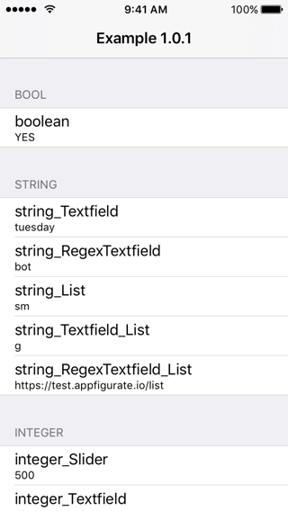

* Launch Appfigurate. We will now add app metadata into Appfigurate in order to be able to configure AppfigurateExample at runtime.
* Tap `≡` `Add app`.
* Select app type `iOS`.
* Enter the URL Scheme `example`. This URL scheme is already setup in AppfigurateExample's `Info.plist` file.
* The private key used to sign configuration payloads will be generated. Depending on the speed of your device this may take a few seconds. The private key generated won't match the public key embedded in `ExampleConfiguration.m`, but that's OK for now, as the `allowInvalidSignatures` method returns `YES` for DEBUG builds and `NO` for RELEASE builds.

#### Reading current configuration

* Tap `≡` `Select app`. Note that your app name is currently listed as `example`. The first successful launch of AppfigurateExample will see the app name, version number and icon updated.
* Tap the `example` row. AppfigurateExample will now be launched. In OS9+ you will need to give Appfigurate permission to launch AppfigurateExample, and vice versa (these prompts will occur only once).
* The screen will briefly flash and control will be given back to Appfigurate. The current configuration of AppfigurateExample will be displayed:

 

In the header section, you'll see the following text:

* *Appfigurate library version x.y.z* - this tells us what version of `libAppfigurateLibrary.a` was linked into AppfigurateExample.
* *Signature is invalid* - this tells us that the private key used to sign the configuration request does not match the public key embedded into the AppfigurateExample app.
* *Debug build - App allows invalid signature* - this tells us that the `allowInvalidSignatures` method in the app returned `YES` - which means this is a DEBUG build.

#### Changing and applying configuration

Below the header section, the table rows list all of the configuration properties coded into the `ExampleConfiguration.h/ExampleConfiguration.m` files. We will now change some of the configuration property values:

* *boolean* - toggle the switch to the `OFF` position.
* *string_Textfield* - change the text to `wednesday`.
* *string_List* - select `Medium` from the list.

We are now ready to apply the updated configuration to the AppfigurateExample app.

* Tap the `Apply ⌄` button in navigation bar. The AppfigurateExample app will now be launched, and the configuration applied. A dialog will appear: *Appfigurate - Configuration applied*. Tap `OK` to dismiss.
* The AppfigurateExample app should now display the following:

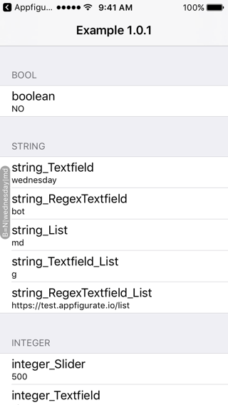

* The configuration is persisted to the keychain, and will reset to defaults after 7 days.
* The `APLConfigurationLabel` on the left hand side of the view controller is optional. For more information see [displaying overridden configuration](OverriddenConfiguration.md).

#### Resetting configuration

* Tap the `< Appfigu...` text in the status bar to relaunch Appfigurate.
* Tap `Example x.y.z`. Notice how the name, version and icon have been updated.
* The screen will briefly flash and control given back to Appfigurate. The current configuration of AppfigurateExample will be displayed.
* To reset the app's configuration back to defaults, **long press** the `Apply ⌄` button in the navigation bar. The following menu will be displayed:

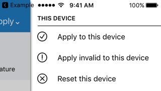

* If you're running on a real device rather than the Simulator, you'll have some additional options for applying configuration remotely (through SMS/Email).
* Tap the `Reset this device` option.
* The AppfigurateExample app will now be launched, and it's configuration reset back to defaults.

#### Testing allowInvalidSignatures

* Since we are running a DEBUG build, and `allowInvalidSignatures` returns `YES`, we have been able to apply configuration without using the correct private key. Let's change that.
* In Xcode, open `ExampleConfiguration.m`. Change the `allowInvalidSignatures` method to the following:

> Objective-C

```objc
- (BOOL) allowInvalidSignatures {
    return NO;
}
```

* Tap run to reinstall AppfigurateExample with the updated code.
* Once AppfigurateExample is installed, relaunch Appfigurate.
* Tap `Example x.y.z`. The screen will briefly flash and control will be given back to Appfigurate. The current configuration of AppfigurateExample will *not* be displayed due the signature mismatch and `allowInvalidSignatures` returning `NO`.

#### Embedding the real public key

* In Appfigurate, tap `≡` `Example x.y.z`.
* The following screen will be displayed:

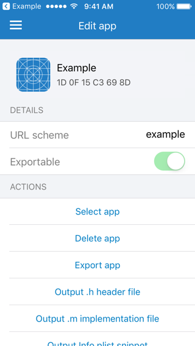

* Tap `Output .m implementation file`. We're not interested in the whole file, just the public key.
* Choose an output method, and tap `Output`.
* The .m implementation file will look similar to this (your public key *will* differ to the one displayed below):

> Objective-C - your output .m implementation file:

```objc
#import "Configuration.h"

@implementation Configuration

BOOL_PROPERTY(debugLogging, @"Log debug output to console")
STRING_PROPERTY_LIST_EDIT(serverURL, @"https:\\/\\/[\\w\\.-]+\\.yourappserver.com/.*", @"URL of app server", @{@"Dev":@"https://dev.yourappserver.com/api", @"Prod":@"https://www.yourappserver.com/api"});

- (BOOL) allowInvalidSignatures {
#if DEBUG
	return YES;
#else
	return NO;
#endif
}

- (NSString*) publicKey {
	// 1D 0F 15 C3 69 8D
	return @"-----BEGIN PUBLIC KEY-----\n" \
		"MIIBIjANBgkqhkiG9w0BAQEFAAOCAQ8AMIIBCgKCAQEAqapUve6Hzrd1el1WeT6a\n" \
		"BHDUJWBbOsHhQjDp1ch8VwsNTRhECjRpBSlZLHF8c//IFbTlZym849IRnB39bWTo\n" \
		"KgPZPTuZSQ3r8t7bshhqCcBHk9P27S6nFFTlQF3AZRvwYSIMyjkn+1ELih/fnw+h\n" \
		"zcQyVZSgaIHNH8uvZCXLZvXP/Lcr81SQdE4SLrYSKIrlJBNGWeCpA+iirkRWQeVg\n" \
		"2SIfW+tAkVei4NnZJLe4SserYIjsO/9G1weUYxgqBBS+/s857FDxPy/h3aPM9qLK\n" \
		"PxljfrRHczLcpwFWQo4UgzuDBQHD8h/CsZU7wK3E6zi6KtzgrHD4zkRvVgk1WbaT\n" \
		"owIDAQAB\n" \
		"-----END PUBLIC KEY-----\n";
}

- (void) reset {
	self.debugLogging = NO;
	self.serverURL = @"https://www.yourappserver.com/api";
}

@end
```

* In Xcode, copy your `publicKey` method you just output and overwrite the `TARGET_OS_IOS` section of `publicKey` in your copy of the `ExampleConfiguration.m` file. (Leaving the `TARGET_OS_WATCH` section intact).

> Objective-C - your ExampleConfiguration.m file:

```objc
- (NSString*) publicKey {
#if TARGET_OS_IOS 
	// 1D 0F 15 C3 69 8D
	return @"-----BEGIN PUBLIC KEY-----\n" \
		"MIIBIjANBgkqhkiG9w0BAQEFAAOCAQ8AMIIBCgKCAQEAqapUve6Hzrd1el1WeT6a\n" \
		"BHDUJWBbOsHhQjDp1ch8VwsNTRhECjRpBSlZLHF8c//IFbTlZym849IRnB39bWTo\n" \
		"KgPZPTuZSQ3r8t7bshhqCcBHk9P27S6nFFTlQF3AZRvwYSIMyjkn+1ELih/fnw+h\n" \
		"zcQyVZSgaIHNH8uvZCXLZvXP/Lcr81SQdE4SLrYSKIrlJBNGWeCpA+iirkRWQeVg\n" \
		"2SIfW+tAkVei4NnZJLe4SserYIjsO/9G1weUYxgqBBS+/s857FDxPy/h3aPM9qLK\n" \
		"PxljfrRHczLcpwFWQo4UgzuDBQHD8h/CsZU7wK3E6zi6KtzgrHD4zkRvVgk1WbaT\n" \
		"owIDAQAB\n" \
		"-----END PUBLIC KEY-----\n";
#elif TARGET_OS_WATCH
	   ...
```

* The comment `// 1D 0F 15 C3 69 8D` in the `publicKey` method can be used to identify that the public key embedded in your code matches the private key inside the Appfigurate app (remember your values will differ):


* In Xcode, tap run to reinstall AppfigurateExample with the updated code.
* Once AppfigurateExample is installed, relaunch Appfigurate.
* Tap `Example x.y.z`. The screen will briefly flash and control will be given back to Appfigurate. The current configuration of AppfigurateExample will be displayed.
* This confirms that your app is using the matching public key. Scroll up the table view to show the header as follows:

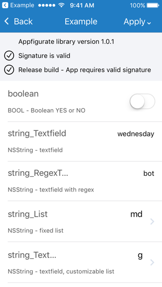

#### Testing using a fake private key

* You can test applying configuration with an invalid private key by **long pressing** the `Apply ⌄` button in the navigation bar. Then tap `Apply invalid to this device`. Rather than using your real private key, a fake private key is used to sign the configuration. Once launched, the AppfigurateExample app will *not* have any configuration applied - the `allowsInvalidSignatures` method is returning `NO`.

## SwiftExample

A functionally identical port of [AppfigurateExample](#appfigurateexample), but in Swift 3 language (compatible with Xcode 8 and 9). The URL Scheme for this example is `swiftexample`. Note that `SwiftExample (iOS)` does *not* embed either `WatchExample (watchOS)` or `ActionExample Extension (iOS)` for brevity.

## ActionExample Extension

This example demonstrates configuring an iOS app extension. This specific example is an Action extension, but any iOS app extension type can be configured. 

For Appfigurate to be able to configure app extensions the following must be observed:

* `APLConfiguration` subclass must be shared between iOS app and app extension.
* Since the configuration is stored in the keychain, the keychain must be shared between the iOS app and app extension.

For more information on keychain sharing and associated `Info.plist` attributes, see [Advanced Configuration](AdvancedConfiguration.md).

#### Setup

Assuming you've followed the [AppfigurateExample](#appfigurateexample) instructions, testing the Action extension is easy.

* Select `ActionExample Extension (iOS)` in Xcode scheme. Tap run.
* Xcode will prompt you with the following:

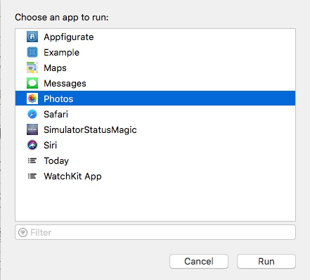

* Select `Photos`, then tap the `Run` button.
* The Photos app will be launched on the Simulator (or connected device).
* Select a photo. 
* Tap the `Share` icon: 


* A toolbar will appear. Swipe right to reveal the `ActionExample` icon:

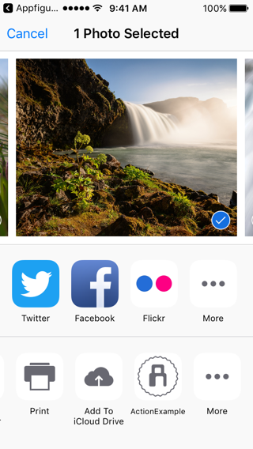

* The ActionExample app extension will now be launched. The example doesn't do anything with a photo, but it does display a storyboard of the current configuration that is shared with the containing iOS app AppfigurateExample.
* Launch Appfigurate. Tap `Example x.y.z`.
* The screen will briefly flash and control will be given back to Appfigurate. The current configuration will be displayed.
* Change the *boolean* switch to the opposite value.
* Tap the `Apply ⌄` button in navigation bar. The AppfigurateExample app will now be launched, and the configuration applied.
* Launch the Photos app again. The ActionExample Extension should still be displayed, if not follow the instructions above to redisplay.
* The ActionExample app extension storyboard of the current configuration will be displayed. The value of the boolean should be updated to reflect the value you applied.

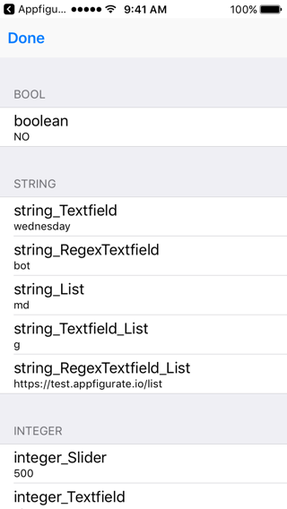

## WatchExample

This example is written in Objective-C and generates a watchOS 2+ compatible app. 

For Appfigurate to be able to configure watchOS apps the following must be observed:

* `APLConfiguration` subclass can optionally be shared between the iOS app and watchOS app.
* When configuring with Appfigurate, the app on the watch **must** be running in the  foreground.
* If your watchOS app uses `WCSessionDelegate`, then you may need to call `APLSessionDidReceiveMessage()` programmatically. See `WCSession` section of [Advanced Configuration](AdvancedConfiguration.md).

#### Setup

* Launch Appfigurate on the paired iPhone.
* Tap `≡` `Add App`.
* Select app type `watchOS`.
* Enter the URL Scheme `example`. This URL scheme is already setup in WatchExample's `Info.plist` file. The scheme name **must** be the same as the containing iOS app that the watchOS app is embedded in.
* The private key used to sign configuration payloads will be generated. Depending on the speed of your device this may take a few seconds.
* The following screen will be displayed:

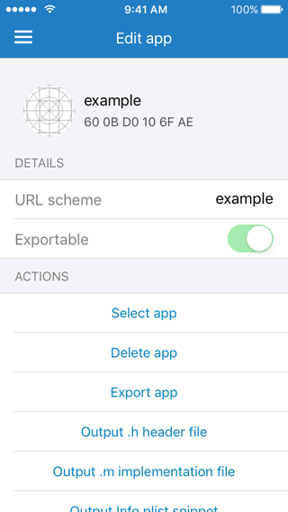

* Tap `Output .m implementation file`. We're not interested in the whole file, just the public key.
* Choose an output method, and tap `Output`.
* The .m implementation file will look similar to this (your public key *will* differ to the one displayed below):

> Objective-C - your output .m implementation file:

```objc
#import "Configuration.h"

@implementation Configuration

BOOL_PROPERTY(debugLogging, @"Log debug output to console")
STRING_PROPERTY_LIST_EDIT(serverURL, @"https:\\/\\/[\\w\\.-]+\\.yourappserver.com/.*", @"URL of app server", @{@"Dev":@"https://dev.yourappserver.com/api", @"Prod":@"https://www.yourappserver.com/api"});

- (BOOL) allowInvalidSignatures {
#if DEBUG
	return YES;
#else
	return NO;
#endif
}

- (NSString*) publicKey {
	// 1E 1F 25 C4 70 8E
	return @"-----BEGIN PUBLIC KEY-----\n" \
		"MIIBIjCCagkqhkiG9w0BAQEFAAOCAQ8AMIIBCgKCAQEAqapUve6Hzrd1el1WeT6a\n" \
		"BHDUJWBbOsHhQjDp1ch8VwsNTRhECjRpBSlZLHF8c//IFbTlZym849IRnB39bWTo\n" \
		"KgPZPTuZSQ3r8t7bshhqCcBHk9P27S6nFFTlQF3AZRvwYSIMyjkn+1ELih/fnw+h\n" \
		"zcQyVZSgaIHNH8uvZCXLZvXP/Lcr81SQdE4SLrYSKIrlJBNGWeCpA+iirkRWQeVg\n" \
		"2SIfW+tAkVei4NnZJLe4SserYIjsO/9G1weUYxgqBBS+/s857FDxPy/h3aPM9qLK\n" \
		"PxljfrRHczMcpwFWQo4UgzuDBQHD8h/CsZU7wK3E6zi6KtzgrHD4zkRvVgk1WbaT\n" \
		"owI0A2bC\n" \
		"-----END PUBLIC KEY-----\n";
}

- (void) reset {
	self.debugLogging = NO;
	self.serverURL = @"https://www.yourappserver.com/api";
}

@end
```

* In Xcode, copy your `publicKey` method you just output and overwrite the `TARGET_OS_WATCH` section of `publicKey` in your copy of the `ExampleConfiguration.m` file. (Leaving the `TARGET_OS_IOS` section intact).

> Objective-C - your ExampleConfiguration.m file:

```objc
- (NSString*) publicKey {
#if TARGET_OS_IOS 
...
#elif TARGET_OS_WATCH
	// 1E 1F 25 C4 70 8E
	return @"-----BEGIN PUBLIC KEY-----\n" \
		"MIIBIjCCagkqhkiG9w0BAQEFAAOCAQ8AMIIBCgKCAQEAqapUve6Hzrd1el1WeT6a\n" \
		"BHDUJWBbOsHhQjDp1ch8VwsNTRhECjRpBSlZLHF8c//IFbTlZym849IRnB39bWTo\n" \
		"KgPZPTuZSQ3r8t7bshhqCcBHk9P27S6nFFTlQF3AZRvwYSIMyjkn+1ELih/fnw+h\n" \
		"zcQyVZSgaIHNH8uvZCXLZvXP/Lcr81SQdE4SLrYSKIrlJBNGWeCpA+iirkRWQeVg\n" \
		"2SIfW+tAkVei4NnZJLe4SserYIjsO/9G1weUYxgqBBS+/s857FDxPy/h3aPM9qLK\n" \
		"PxljfrRHczMcpwFWQo4UgzuDBQHD8h/CsZU7wK3E6zi6KtzgrHD4zkRvVgk1WbaT\n" \
		"owI0A2bC\n" \
		"-----END PUBLIC KEY-----\n";
#endif
}
```

* Select `WatchExample (watchOS)` in Xcode scheme.
* Tap run to install WatchExample onto the Apple Watch, and AppfigurateExample onto the paired iPhone.
* The Apple Watch will display the following:

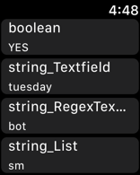

* The example displays a storyboard of the current configuration.

#### Reading current configuration

* On the paired iPhone, run Appfigurate.
* Tap `≡` `Select app`. Note that your app name is currently listed as `example`. The first successful launch of WatchExample will see the app name, version number and icon updated.
* Tap the `example` row. AppfigurateExample will now be launched on the paired iPhone. The iPhone will proxy the configuration request to the Watch.
* The screen will briefly flash and then control will be given back to Appfigurate, at which point the current configuration of WatchExample will be displayed on the screen:


#### Changing and applying configuration

* Change the *boolean* switch to the opposite value.
* Tap the `Apply ⌄` button in navigation bar. The AppfigurateExample app will now be launched on the iPhone. The iPhone will proxy the configuration payload to the Watch.
* The WatchExample will have the configuration payload applied, and the screen will update reflecting the new *boolean* value.

## WatchExample Intent Extension

This example is written in Objective-C and requires watchOS 3. 

For Appfigurate to be able to configure app extensions the following must be observed:

* `APLConfiguration` subclass must be shared between watchOS app extension and watchOS intent extension.
* Since the configuration is stored in the keychain, the keychain must be shared between the watchOS app extension and intent extension

For more information on keychain sharing and associated `Info.plist` attributes, see [Advanced Configuration](AdvancedConfiguration.md).

#### Setup

To test the intent extension, use the instructions for WatchExample above.

#### Testing

Once WatchExample is running, long press the digital crown to invoke Siri.

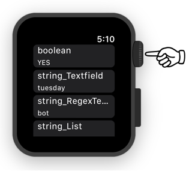

Siri will be invoked:


Speak the following "send message using watch example".


If Siri responds with "unknown app watch example", then you should try again. Siri can take several minutes to recognise a new intent. See Xcode documentation [Test Your Intents App Extension](https://developer.apple.com/documentation/sirikit/creating_an_intents_app_extension) for more details.

Speak the following "bob".

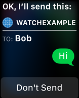

In the console, you will see `NSLog` output, showing the current configuration of `boolean` property in the `ExampleConfiguration` class.

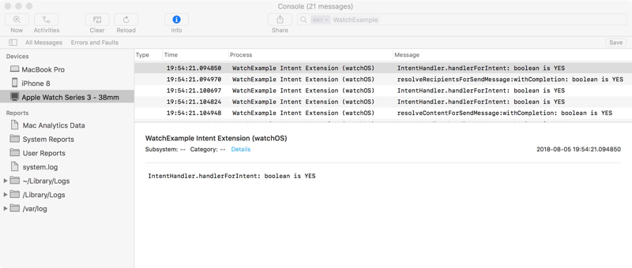

Using Appfigurate on the paired iPhone, change the `boolean` property to the opposite value and click `Apply`. Speak again to Siri, and notice that the `NSLog` output in console has now changed.