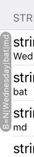

## Displaying overridden configuration

Sometimes it is useful to display the currently applied overridden configuration in your app. We suggest you display this on your app's home screen (generally your `rootViewController`).

The provided `APLConfigurationLabel` displays overridden configuration in a vertical orientation as follows:



> Objective-C

You can add the `APLConfigurationLabel` to your view controller in a `viewDidLoad` like this:

```objc
- (void) viewDidLoad {
    APLConfigurationLabel* label = [[APLConfigurationLabel alloc] initWithFrame: CGRectZero];
    label.center = CGPointMake(7, self.navigationController.view.bounds.size.height / 2);
    [self.navigationController.view addSubview: label];
}
```

> Swift

```swift
override func viewDidLoad() {
    let label = APLConfigurationLabel(frame: .zero)
    label.center = CGPoint(x: 7, y: self.navigationController!.view.bounds.size.height / 2)
    self.navigationController!.view.addSubview(label)
}

```

### Creating your own label

If `APLConfigurationLabel` is not sufficient for your needs, you can create your own label as follows:

> Objective-C

```objc
@interface MyLogonController () <APLConfigurationUpdated>
@end

@implementation MyLogonController

- (void) viewDidLoad {
    APLAddConfigurationUpdatedListener(self);
}

- (void) configurationUpdated: (NSNotification*) notification {
    label.text = [[APLConfiguration sharedConfiguration] modifications];
}
```

> Swift

```swift
extension MyLogonController: APLConfigurationUpdated {

override func viewDidLoad() {
    APLAddConfigurationUpdatedListener(self)
}

func configurationUpdated(_ notification: Notification?) {
    label.text = APLConfiguration.shared().modifications
}
```