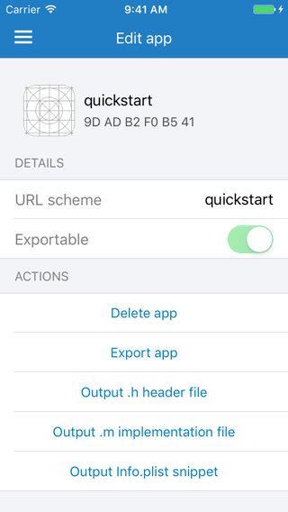
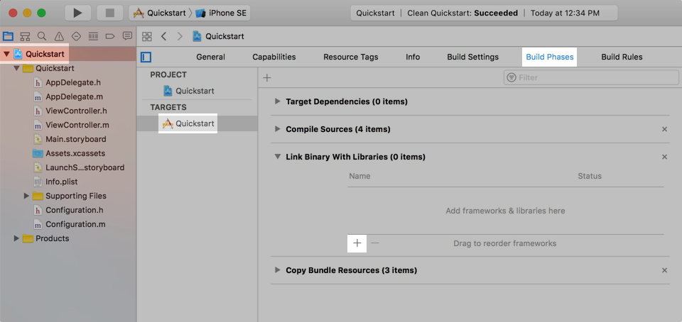
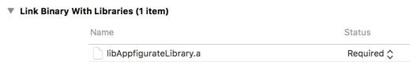
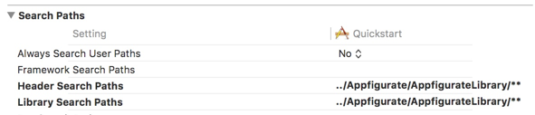
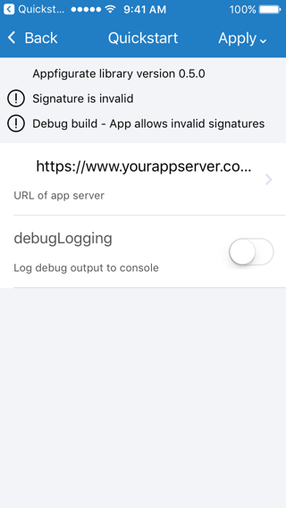

# Appfigurate Library - Quick Start Guide

## Installing the library into your own app using Carthage (experimental)

The Appfigurate library can be embedded into your own app in 6 easy steps. In this guide, replace any references to `quickstart` with your own apps project name or target name (as appropriate).

### Step 1: Run Appfigurate Simulator

* Tap `≡` `Add app`.
* Select your app type `iOS`.
* Enter the URL Scheme `quickstart` that will be used by Appfigurate to launch your app in order to read or apply configuration. The URL scheme must be 4-64 ascii characters in length and must be unique to your app.
* Once the app is added, tap the `Output .h header file` command, select `Console` as the output method.
* Tap the `Output .m implementation file` command, select `Console` as the output method.
* Tap the `Output Info.plist snippet` command, select `Console` as the output method.



### Step 2: Edit Info.plist

In your apps `Info.plist` file (right click, Open As->Source Code). Insert the `Info.plist` snippet output to the Console in step 1.

```xml
<key>CFBundleURLTypes</key>
<array>
	<dict>
		<key>CFBundleURLName</key>
		<string>appfigurate.quickstart</string>
		<key>CFBundleURLSchemes</key>
		<array>
			<string>quickstart</string>
		</array>
	</dict>
</array>
```
If you already have an existing `CFBundleURLTypes` array in your `Info.plist` file, then insert just the `<dict> ... </dict>` portion.

### Step 3: Adjust Cartfile

* Add the following to your apps Cartfile:

```
github "electricbolt/appfiguratesdk"
```

* Run the `carthage update` from the terminal to download the appfiguratesdk repository into your apps `Carthage/Checkouts` directory.
* Note that Carthage will output the following error:

```
*** Skipped building appfiguratesdk due to the error:
Dependency "appfiguratesdk" has no shared framework schemes

If you believe this to be an error, please file an issue with the maintainers at https://github.com/electricbolt/appfiguratesdk/issues/new
```

You can ignore this error as we will be using the `Carthage/Checkouts` directory in the next step (instead of the `Carthage/Build`).

### Step 4: Add libAppfigurateLibrary.a



* Select your project `Quickstart` in the project navigator.
* Select your target `Quickstart` in the project/targets pane.
* Select `Build Phases` tab
* Expand section `Link Binary with Libraries`.
* Tap `+` button
* On the `Choose frameworks and libaries to add` dialog, tap the `Add Other...` button.
* Navigate to the `Carthage/Checkouts/Appfigurate/AppfigurateLibrary/` directory and select libAppfigurateLibrary.a



### Step 5: Apply Search Paths

* Select `Build Settings` tab
* Scroll down to `Search Paths` section
* Add the relative path to the Appfigurate repository to the `Header Search Paths`. e.g. `../Carthage/Checkouts/Appfigurate/AppfigurateLibrary`.
* Add the relative path to the Appfigurate repository to the `Library Search Paths`.



### Step 6: Create APLConfiguration subclass

> Objective-C

In your app, add a new Cocoa Touch class, subclassing `APLConfiguration`, called `Configuration`.

In your apps `Configuration.h` file, paste the .h header file output to the Console in step 1.

```objc
#import <Foundation/Foundation.h>
#import "Appfigurate.h"

@interface Configuration : APLConfiguration

@property(nonatomic, strong) NSString* serverURL;
@property(nonatomic, assign) BOOL debugLogging;

@end
```

In your apps `Configuration.m` file, paste the .m implementation file output to the Console in step 1.

```objc
#import "Configuration.h"

@implementation Configuration

BOOL_PROPERTY(debugLogging, @"Log debug output to console")
STRING_PROPERTY_LIST_EDIT(serverURL, @"https://[\\w\\.-]+\\.yourappserver.com/.*", @"URL of app server", @{@"Dev":@"https://dev.yourappserver.com/api", @"Prod":@"https://www.yourappserver.com/api"});

- (BOOL) allowInvalidSignatures {
#if DEBUG
	return YES;
#else
	return NO;
#endif
}

- (NSString*) publicKey {
	// 50 A7 F6 D1 CA 7D
	return @"-----BEGIN PUBLIC KEY-----\n" \
		"MIIBIjANBgkqhkiG9w0BAQEFAAOCAQ8AMIIBCgKCAQEA1DkaOZj7czu3vNFMSQmi\n" \
		"Lp2q0nSRIehlXksMJ+GXTa/AAxFe6LsiUHsR+yY6aBDK5Xj8COO04+1VmPJcLBh+\n" \
		"C6OMtThZvvbvpvU8ReUP0OsG8yKhVB2foHVibUoJ4ZvIeiw8Nw0CW6cK+ZqlkEph\n" \
		"aeyDg9hMi/C1BW+VX6f9MBP7BX7Ba4MxKvqU9auKM2pajm9CbRMGhjWoxPlbE9eS\n" \
		"F/U/LJpagESNih+fk/h4w9SxzkfcBoXk/6YFyu17difr/VF4l0SNRPds5fFvUPPe\n" \
		"89JZUYnEuLcrF6/AD8+KJJ9EToKMLhzBMcoLmoslWYmnjW1OCv6fj8SaY8c3kHvh\n" \
		"WQIDAQAB\n" \
		"-----END PUBLIC KEY-----\n";
}

- (void) reset {
	self.debugLogging = NO;
	self.serverURL = @"https://www.yourappserver.com/api";
}

@end
```

> Swift

Appfigurate relies upon the C Preprocessor Macros to automatically generate method implementations of your configuration properties; writing an `APLConfiguration` subclass in Swift is not recommended. (A pure Swift example is available in  AppfigurateExamples/SwiftExample/ExampleConfiguration.swift for reference)

## Test your configuration subclass

To test that you've successfully updated your app to use Appfigurate:

* Compile and run `Quickstart` to the same Simulator instance that Appfigurate Simulator was run from previously.
* Press `Shift-Cmd-H` to get back to the Simulator home screen.
* Tap the Appfigurate app icon.
* Tap the `Quickstart` row. The Simulator screen will briefly flicker as it swaps to the `Quickstart` app, reads its configuration and swaps back to Appfigurate.
* Appfigurate will now be displayed and showing the following screen:
 


* Since we added a `BOOL_PROPERTY` for `debugLogging` and `STRING_PROPERTY_LIST_EDIT` for `serverURL`, you can now change these configuration items at runtime. Tap (or long tap for additional options) `Apply` to apply the configuration to the `Quickstart` app.