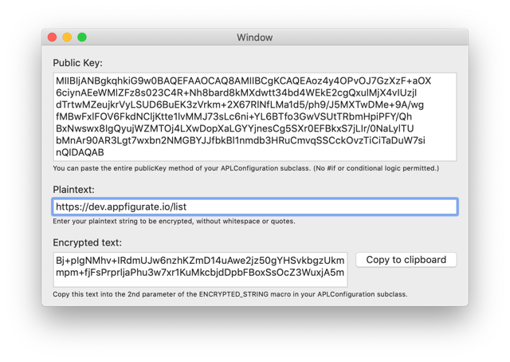

# StringEncryption utility

The StringEncryption utility is used in conjunction with the `ENCRYPTED_STRING` and `ENCRYPTED_STRING_IOS_WATCHOS` macros. 

The StringEncryption utility is included in the root of the repository, and is signed and notarized for Gatekeeper.



### `ENCRYPTED_STRING` macro

For an iOS app where the `APLConfiguration` subclass has one public key use the `ENCRYPTED_STRING` macro for each list item in the `ENCRYPTED_STRING_PROPERTY_LIST_EDIT`.

Step 1. Copy the public key from the `publicKey` method of your APLConfiguration subclass in Xcode.

> Objective-C

```objc
- (NSString*) publicKey {
    return @"-----BEGIN PUBLIC KEY-----\n" \
"MIIBIjANBgkqhkiG9w0BAQEFAAOCAQ8AMIIBCgKCAQEAoz4y4OPvOJ7GzXzF+aOX\n" \
"6ciynAEeWMlZFz8s023C4R+Nh8bard8kMXdwtt34bd4WEkE2cgQxulMjX4vIUzjI\n" \
        "dTrtwMZeujkrVyLSUD6BuEK3zVrkm+2X67RlNfLMa1d5/ph9/J5MXTwDMe+9A/wg\n" \
"fMBwFxlFOV6FkdNCljKtte1lvMMJ73sLc6ni+YL6BTfo3GwVSUtTRbmHpiPFY/Qh\n" \
        "BxNwswx8IgQyujWZMTOj4LXwDopXaLGYYjnesCg5SXr0EFBkxS7jLIr/0NaLylTU\n" \
"bMnAr90AR3Lgt7wxbn2NMGBYJJfbkBl1nmdb3HRuCmvqSSCckOvzTiCiTaDuW7si\n" \
        "nQIDAQAB\n" \
        "-----END PUBLIC KEY-----\n";
}
```

You can copy the multi line string including the `return` keyword and line breaks as follows:

```objc
    return @"-----BEGIN PUBLIC KEY-----\n" \
"MIIBIjANBgkqhkiG9w0BAQEFAAOCAQ8AMIIBCgKCAQEAoz4y4OPvOJ7GzXzF+aOX\n" \
"6ciynAEeWMlZFz8s023C4R+Nh8bard8kMXdwtt34bd4WEkE2cgQxulMjX4vIUzjI\n" \
        "dTrtwMZeujkrVyLSUD6BuEK3zVrkm+2X67RlNfLMa1d5/ph9/J5MXTwDMe+9A/wg\n" \
"fMBwFxlFOV6FkdNCljKtte1lvMMJ73sLc6ni+YL6BTfo3GwVSUtTRbmHpiPFY/Qh\n" \
        "BxNwswx8IgQyujWZMTOj4LXwDopXaLGYYjnesCg5SXr0EFBkxS7jLIr/0NaLylTU\n" \
"bMnAr90AR3Lgt7wxbn2NMGBYJJfbkBl1nmdb3HRuCmvqSSCckOvzTiCiTaDuW7si\n" \
        "nQIDAQAB\n" \
        "-----END PUBLIC KEY-----\n";
```

Step 2. Paste the public key into the StringEncryption app's Public Key text field. The public key will be reformatted automatically.

Step 3. Copy the plain text from the first parameter of the `ENCRYPTED_STRING` macro in Xcode.

```objc
ENCRYPTED_STRING_PROPERTY_LIST_EDIT(
	url, 
	@"https://[\\w\\.-]+\\.appfigurate.io/.*", 
	@"server url", 
	@{@"Dev":ENCRYPTED_STRING(@"https://dev.appfigurate.io/list",@"")});
```

Copy just the plain text value without surrounding quotes as follows:

```objc
https://dev.appfigurate.io/list
```

Step 4. Paste the plain text value into the Plain text field of the StringEncryption app.

The cipher text will be computed automatically and placed into the Encrypted text field of the StringEncryption app.

Step 5. Copy the Encrypted text field from the StringEncryption app and paste into the 2nd parameter of the `ENCRYPTED_STRING` macro in Xcode:

```objc
ENCRYPTED_STRING_PROPERTY_LIST_EDIT(
    url, 
    @"https://[\\w\\.-]+\\.appfigurate.io/.*", 
    @"server url", 
    @{@"Dev":ENCRYPTED_STRING(@"https://dev.appfigurate.io/list",
    @"Bj+pIgNMhv+IRdmUJw6nzhKZmD14uAwe2jz50gYHSvkbgzUkmmpm+fjFsPrprljaPhu3w7xr1KuMkcbjdDpbFBoxSsOcZ3WuxjA5mHv1h/inZpi2/cAH/UjhshPO2VQ8FkWg9shduqCEDbjMuO8ammVA5x+zg7oVTPJXbJUH1P3I49f3Sc/Lg2LpxyEXIDFtgpYq5FX1qNa3mu842OMSkJ6NVEI+CDi4hRNz7P+ie2d8Dqlm+w0cvoV91Dc94bUveQsqiAcshTkqmlxxI5uZc+oKR8pQK+RX0pEZz+U2XR4herhDV3Qd/J8YAhL4qkIpxDMaYmiW7EK0RVszlwSDf/t+jPZE0cYVq3jF/ZYHh1S2k3mFRRnyO/gYgf5+SPB6AQ==")});
```

### `ENCRYPTED_STRING_IOS_WATCHOS` macro

For an iOS and watchOS app where the `APLConfiguration` subclass has two public keys, use the `ENCRYPTED_STRING_IOS_WATCHOS` macro for each list item in the `ENCRYPTED_STRING_PROPERTY_LIST_EDIT` macro. 

##### iOS

Step 1. Copy the iOS public key from the `publicKey` method of your APLConfiguration subclass in Xcode.

> Objective-C

```objc
- (NSString*) publicKey {
#if TARGET_OS_IOS
    // 69 98 C5 AE 18 DD
    return @"-----BEGIN PUBLIC KEY-----\n" \
        "MIIBIjANBgkqhkiG9w0BAQEFAAOCAQ8AMIIBCgKCAQEAoz4y4OPvOJ7GzXzF+aOX\n" \
        "6ciynAEeWMlZFz8s023C4R+Nh8bard8kMXdwtt34bd4WEkE2cgQxulMjX4vIUzjI\n" \
        "dTrtwMZeujkrVyLSUD6BuEK3zVrkm+2X67RlNfLMa1d5/ph9/J5MXTwDMe+9A/wg\n" \
        "fMBwFxlFOV6FkdNCljKtte1lvMMJ73sLc6ni+YL6BTfo3GwVSUtTRbmHpiPFY/Qh\n" \
        "BxNwswx8IgQyujWZMTOj4LXwDopXaLGYYjnesCg5SXr0EFBkxS7jLIr/0NaLylTU\n" \
        "bMnAr90AR3Lgt7wxbn2NMGBYJJfbkBl1nmdb3HRuCmvqSSCckOvzTiCiTaDuW7si\n" \
        "nQIDAQAB\n" \
        "-----END PUBLIC KEY-----\n";
#elif TARGET_OS_WATCH
    return @"-----BEGIN PUBLIC KEY-----\n" \
        "MIIBIjANBgkqhkiG9w0BAQEFAAOCAQ8AMIIBCgKCAQEA5s2YXfKStHzgUEkY+KDm\n" \
        "yQUMO617+xo2tv5DF4M38emK7XpLR/ILLFiAiIHyRAdw9+wB80OEzek+bihwHWCs\n" \
        "WU0inAJ7gBLRqv7MHhPP4+XBbeizpLblPdBVVL1az5I3oDptpemIikAZrA37ZAH/\n" \
        "shk9C/wGogiQC4p60LmxbzI/+eYvI2x0M/Xxxpedcq6yRyHb+u+0ziNHoji5M6Qh\n" \
        "kcsailsMqANaN7VcO5NLPT3PzIc6WPG3iVJ0I8iCzXY/QNxOAtWc5t4CyB8+Z+fU\n" \
        "IEk9qAYiidZhpPb1gdJl4LN14qjBqYAmmJAo9oAabujlGmvxKQfR3Mj1FDd1GYab\n" \
        "6QIDAQAB\n" \
        "-----END PUBLIC KEY-----\n";
#endif
}
```

You can copy the multi line string including the `return` keyword and line breaks as follows:

```objc
    return @"-----BEGIN PUBLIC KEY-----\n" \
"MIIBIjANBgkqhkiG9w0BAQEFAAOCAQ8AMIIBCgKCAQEAoz4y4OPvOJ7GzXzF+aOX\n" \
"6ciynAEeWMlZFz8s023C4R+Nh8bard8kMXdwtt34bd4WEkE2cgQxulMjX4vIUzjI\n" \
        "dTrtwMZeujkrVyLSUD6BuEK3zVrkm+2X67RlNfLMa1d5/ph9/J5MXTwDMe+9A/wg\n" \
"fMBwFxlFOV6FkdNCljKtte1lvMMJ73sLc6ni+YL6BTfo3GwVSUtTRbmHpiPFY/Qh\n" \
        "BxNwswx8IgQyujWZMTOj4LXwDopXaLGYYjnesCg5SXr0EFBkxS7jLIr/0NaLylTU\n" \
"bMnAr90AR3Lgt7wxbn2NMGBYJJfbkBl1nmdb3HRuCmvqSSCckOvzTiCiTaDuW7si\n" \
        "nQIDAQAB\n" \
        "-----END PUBLIC KEY-----\n";
```

Step 2. Paste the iOS public key into the StringEncryption app's Public Key text field. The public key will be reformatted automatically.

Step 3. Copy the plain text from the first parameter of the `ENCRYPTED_STRING_IOS_WATCHOS` macro in Xcode.

```objc
ENCRYPTED_STRING_PROPERTY_LIST_EDIT(
	url, 
	@"https://[\\w\\.-]+\\.appfigurate.io/.*", 
	@"server url", 
	@{@"Dev": ENCRYPTED_STRING_IOS_WATCHOS(@"https://dev.appfigurate.io/list",@"",@"")});
```

Copy just the plain text value without surrounding quotes as follows:

```objc
https://dev.appfigurate.io/list
```

Step 4. Paste the plain text value into the Plain text field of the StringEncryption app.

The cipher text will be computed automatically and placed into the Encrypted text field of the StringEncryption app.

Step 5. Copy the Encrypted text field from the StringEncryption app and paste into the 2nd parameter of the `ENCRYPTED_STRING_IOS_WATCHOS` macro in Xcode:

```objc
ENCRYPTED_STRING_PROPERTY_LIST_EDIT(
    url, 
    @"https://[\\w\\.-]+\\.appfigurate.io/.*", 
    @"server url", 
    @{@"Dev": ENCRYPTED_STRING_IOS_WATCHOS(@"https://dev.appfigurate.io/list",
        @"Bj+pIgNMhv+IRdmUJw6nzhKZmD14uAwe2jz50gYHSvkbgzUkmmpm+fjFsPrprljaPhu3w7xr1KuMkcbjdDpbFBoxSsOcZ3WuxjA5mHv1h/inZpi2/cAH/UjhshPO2VQ8FkWg9shduqCEDbjMuO8ammVA5x+zg7oVTPJXbJUH1P3I49f3Sc/Lg2LpxyEXIDFtgpYq5FX1qNa3mu842OMSkJ6NVEI+CDi4hRNz7P+ie2d8Dqlm+w0cvoV91Dc94bUveQsqiAcshTkqmlxxI5uZc+oKR8pQK+RX0pEZz+U2XR4herhDV3Qd/J8YAhL4qkIpxDMaYmiW7EK0RVszlwSDf/t+jPZE0cYVq3jF/ZYHh1S2k3mFRRnyO/gYgf5+SPB6AQ==",@"")});
```

##### watchOS

Step 1. Copy the watchOS public key from the `publicKey` method of your APLConfiguration subclass in Xcode.

> Objective-C

```objc
- (NSString*) publicKey {
#if TARGET_OS_IOS
    // 69 98 C5 AE 18 DD
    return @"-----BEGIN PUBLIC KEY-----\n" \
        "MIIBIjANBgkqhkiG9w0BAQEFAAOCAQ8AMIIBCgKCAQEAoz4y4OPvOJ7GzXzF+aOX\n" \
        "6ciynAEeWMlZFz8s023C4R+Nh8bard8kMXdwtt34bd4WEkE2cgQxulMjX4vIUzjI\n" \
        "dTrtwMZeujkrVyLSUD6BuEK3zVrkm+2X67RlNfLMa1d5/ph9/J5MXTwDMe+9A/wg\n" \
        "fMBwFxlFOV6FkdNCljKtte1lvMMJ73sLc6ni+YL6BTfo3GwVSUtTRbmHpiPFY/Qh\n" \
        "BxNwswx8IgQyujWZMTOj4LXwDopXaLGYYjnesCg5SXr0EFBkxS7jLIr/0NaLylTU\n" \
        "bMnAr90AR3Lgt7wxbn2NMGBYJJfbkBl1nmdb3HRuCmvqSSCckOvzTiCiTaDuW7si\n" \
        "nQIDAQAB\n" \
        "-----END PUBLIC KEY-----\n";
#elif TARGET_OS_WATCH
    return @"-----BEGIN PUBLIC KEY-----\n" \
        "MIIBIjANBgkqhkiG9w0BAQEFAAOCAQ8AMIIBCgKCAQEA5s2YXfKStHzgUEkY+KDm\n" \
        "yQUMO617+xo2tv5DF4M38emK7XpLR/ILLFiAiIHyRAdw9+wB80OEzek+bihwHWCs\n" \
        "WU0inAJ7gBLRqv7MHhPP4+XBbeizpLblPdBVVL1az5I3oDptpemIikAZrA37ZAH/\n" \
        "shk9C/wGogiQC4p60LmxbzI/+eYvI2x0M/Xxxpedcq6yRyHb+u+0ziNHoji5M6Qh\n" \
        "kcsailsMqANaN7VcO5NLPT3PzIc6WPG3iVJ0I8iCzXY/QNxOAtWc5t4CyB8+Z+fU\n" \
        "IEk9qAYiidZhpPb1gdJl4LN14qjBqYAmmJAo9oAabujlGmvxKQfR3Mj1FDd1GYab\n" \
        "6QIDAQAB\n" \
        "-----END PUBLIC KEY-----\n";
#endif
}
```

You can copy the multi line string including the `return` keyword and line breaks as follows:

```objc
    return @"-----BEGIN PUBLIC KEY-----\n" \
        "MIIBIjANBgkqhkiG9w0BAQEFAAOCAQ8AMIIBCgKCAQEA5s2YXfKStHzgUEkY+KDm\n" \
        "yQUMO617+xo2tv5DF4M38emK7XpLR/ILLFiAiIHyRAdw9+wB80OEzek+bihwHWCs\n" \
        "WU0inAJ7gBLRqv7MHhPP4+XBbeizpLblPdBVVL1az5I3oDptpemIikAZrA37ZAH/\n" \
        "shk9C/wGogiQC4p60LmxbzI/+eYvI2x0M/Xxxpedcq6yRyHb+u+0ziNHoji5M6Qh\n" \
        "kcsailsMqANaN7VcO5NLPT3PzIc6WPG3iVJ0I8iCzXY/QNxOAtWc5t4CyB8+Z+fU\n" \
        "IEk9qAYiidZhpPb1gdJl4LN14qjBqYAmmJAo9oAabujlGmvxKQfR3Mj1FDd1GYab\n" \
        "6QIDAQAB\n" \
        "-----END PUBLIC KEY-----\n";
```

Step 2. Paste the watchOS public key into the StringEncryption app's Public Key text field. The public key will be reformatted automatically.

Step 3. Copy the plain text from the first parameter of the `ENCRYPTED_STRING_IOS_WATCHOS` macro in Xcode.

```objc
ENCRYPTED_STRING_PROPERTY_LIST_EDIT(
	url, 
	@"https://[\\w\\.-]+\\.appfigurate.io/.*", 
	@"server url", 
	@{@"Dev": ENCRYPTED_STRING_IOS_WATCHOS(@"https://dev.appfigurate.io/list",
	        @"Bj+pIgNMhv+IRdmUJw6nzhKZmD14uAwe2jz50gYHSvkbgzUkmmpm+fjFsPrprljaPhu3w7xr1KuMkcbjdDpbFBoxSsOcZ3WuxjA5mHv1h/inZpi2/cAH/UjhshPO2VQ8FkWg9shduqCEDbjMuO8ammVA5x+zg7oVTPJXbJUH1P3I49f3Sc/Lg2LpxyEXIDFtgpYq5FX1qNa3mu842OMSkJ6NVEI+CDi4hRNz7P+ie2d8Dqlm+w0cvoV91Dc94bUveQsqiAcshTkqmlxxI5uZc+oKR8pQK+RX0pEZz+U2XR4herhDV3Qd/J8YAhL4qkIpxDMaYmiW7EK0RVszlwSDf/t+jPZE0cYVq3jF/ZYHh1S2k3mFRRnyO/gYgf5+SPB6AQ==",
    	    @"")});
```

Copy just the plain text value without surrounding quotes as follows:

```objc
https://dev.appfigurate.io/list
```

Step 4. Paste the plain text value into the Plain text field of the StringEncryption app.

The cipher text will be computed automatically and placed into the Encrypted text field of the StringEncryption app.

Step 5. Copy the Encrypted text field from the StringEncryption app and paste into the 2nd parameter of the `ENCRYPTED_STRING_IOS_WATCHOS` macro in Xcode:

```objc
ENCRYPTED_STRING_PROPERTY_LIST_EDIT(
    url, 
    @"https://[\\w\\.-]+\\.appfigurate.io/.*", 
    @"server url", 
    @{@"Dev": ENCRYPTED_STRING_IOS_WATCHOS(@"https://dev.appfigurate.io/list",
        @"Bj+pIgNMhv+IRdmUJw6nzhKZmD14uAwe2jz50gYHSvkbgzUkmmpm+fjFsPrprljaPhu3w7xr1KuMkcbjdDpbFBoxSsOcZ3WuxjA5mHv1h/inZpi2/cAH/UjhshPO2VQ8FkWg9shduqCEDbjMuO8ammVA5x+zg7oVTPJXbJUH1P3I49f3Sc/Lg2LpxyEXIDFtgpYq5FX1qNa3mu842OMSkJ6NVEI+CDi4hRNz7P+ie2d8Dqlm+w0cvoV91Dc94bUveQsqiAcshTkqmlxxI5uZc+oKR8pQK+RX0pEZz+U2XR4herhDV3Qd/J8YAhL4qkIpxDMaYmiW7EK0RVszlwSDf/t+jPZE0cYVq3jF/ZYHh1S2k3mFRRnyO/gYgf5+SPB6AQ==",
        @"wUSKc6eNUXnsQyTBn1O91gczDtw6zpzRUHHb613Y3kqyhL3MNwpYWwGCN6Q9m5apibl5etf8ceMRnjU2JprwcWY/PTs+sYshRgfBRuO/kALXThJpRBmWnbptLZIvp5anQdZ9So09a2kFvkZFGWaUkNcExXlfXLGdFBmwRGwaq7q2+Y+eKvNvY2qSEBQ9oV7kx9KT0BabLjulKh1023zCZgFK/oifHJShaEiUJ4bKT3OQiIcSo7z1O7pV470ozgon9y0bLTA0H0se3CCNCcrSY5ZIzcI0nTF20Er/6L5/PwPq1Ea0JBLsaAdLVSiXjqGgnU2oqAxzTso6FvikEeGS81jlQ8WlebTyebxFyffGfRqNpWkxB10DuaVMO4XK4UFTAQ==")});
```
