# Subclassing APLConfiguration

## Supported property types

Appfigurate supports the following types of properties:
`BOOL`, `NSInteger`, `float`, `double`, `NSString`.

### BOOL

`BOOL` properties must be either `YES` or `NO`. The default value of a `BOOL` property is `NO`. You can change the default value of the property by assigning a new value in an overridden `reset` method.

`BOOL` properties should be declared in your `APLConfiguration` subclass header file as follows:

`@property(assign) BOOL propertyName;`

#### BOOL switch implementation

`BOOL_PROPERTY(propertyName, description)`

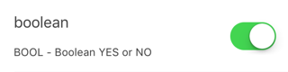

Allows the `BOOL` property to be changed in Appfigurate using a `UISwitch`.

> Objective-C example

```objc
@interface Configuration : APLConfiguration
@property(nonatomic, assign) BOOL logging;
@end

@implementation Configuration
BOOL_PROPERTY(logging, @"Enable debug logging to console");
...
```

### NSInteger

`NSInteger` is platform dependent, 32-bit signed values on 32-bit CPUs and 64-bit signed values on 64-bit CPUs. The default value of a `NSInteger` is 0. You can change the default value of the property by assigning a new value in an overridden `reset` method.

`@property(assign) NSInteger propertyName;`

#### NSInteger slider implementation

`INT_PROPERTY_SLIDER(propertyName, minValue, maxValue, icon, description)`

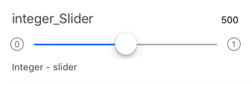

The `NSInteger` property can be changed in Appfigurate using a `UISlider` between minimum and maximum values. You can customize the minimum and maximum images using the icon parameter.

> Objective-C example

```objc
@interface Configuration : APLConfiguration
@property(nonatomic, assign) NSInteger volumeRange;
@end

@implementation Configuration
INT_PROPERTY_SLIDER(volumeRange, 50, 100, APLIconSliderVolume, @"Limit volume level");
...
```

#### NSInteger editable implementation

`INT_PROPERTY_EDIT(propertyName, minValue, maxValue, regex, description)`

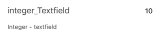

The `NSInteger` property can be changed in Appfigurate using a `UITextField` between minimum and maximum values, and an optional regular expression validating input.

> Objective-C example

```objc
@interface Configuration : APLConfiguration
@property(nonatomic, assign) NSInteger gameLevels;
@end

@implementation Configuration
INT_PROPERTY_EDIT(gameLevels, 1, 5, @"", @"Maximum number of game levels");
...
```

#### NSInteger list implementation

`INT_PROPERTY_LIST(propertyName, description, ...)`

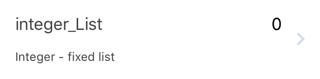

The `NSInteger` property can be changed in Appfigurate by allowing the user to select from a predefined list of valid choices.

> Objective-C example

```objc
@interface Configuration : APLConfiguration
@property(nonatomic, assign) NSInteger rating;
@end

@implementation Configuration
INT_PROPERTY_LIST(rating, @"Quality rating", @{@"Low":@10,@"Average":@50,@"Excellent":@95});
...
```

#### NSInteger editable list implementation

`INT_PROPERTY_LIST_EDIT(propertyName, minValue, maxValue, regex, description, ...)`

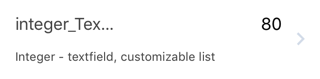

The `NSInteger` property can be changed in Appfigurate by allowing the user to select from a predefined list of valid choices. The user can customize the list adding by additional values using a `UITextField` between minimum and maximum values, and an optional regular expression validating input.

> Objective-C example

```objc
@interface Configuration : APLConfiguration
@property(nonatomic, assign) NSInteger availabilityDuration;
@end

@implementation Configuration
INT_PROPERTY_LIST_EDIT(availablityDuration, 0, 365, @"^(0?[0-9]?[0-9]|[1-2][0-9][0-9]|3[0-5][0-9]|36[0-5])$", @"Duration in days emails are available", @{@"7 days":@7,@"1 month":@30,@"1 Year":@365});
...
```

### float

`float` is a 4 byte floating point type with an approximate range of 1.2E-38 to 3.4E+38. The default value of a `float` is 0.0. You can change the default value of the property by assigning a new value in an overridden `reset` method.

`@property(assign) float propertyName;`

#### float slider implementation

`FLOAT_PROPERTY_SLIDER(propertyName, minValue, maxValue, icon, description)`

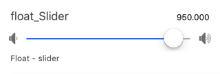

The `float` property can be changed in Appfigurate using a `UISlider` between minimum and maximum values. You can customize the minimum and maximum images using the `icon` parameter.

> Objective-C example

```objc
@interface Configuration : APLConfiguration
@property(nonatomic, assign) float maxDecibel;
@end

@implementation Configuration
FLOAT_PROPERTY_SLIDER(maxDecibel, 60.5, 120.41, APLIconSliderVolume, @"Clipping - decibels");
...
```

#### float editable implementation

`FLOAT_PROPERTY_EDIT(propertyName, minValue, maxValue, regex, description)`

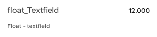

The `float` property can be changed in Appfigurate using a `UITextField` between minimum and maximum values, and an optional regular expression validating input.

> Objective-C example

```objc
@interface Configuration : APLConfiguration
@property(nonatomic, assign) float shotAccuracy;
@end

@implementation Configuration
FLOAT_PROPERTY_EDIT(shotAccuracy, -2.1, 4.1, @"", @"Shot accuracy");
...
```

#### float list implementation

`FLOAT_PROPERTY_LIST(propertyName, description, ...)`

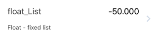

The `float` property can be changed in Appfigurate by allowing the user to select from a predefined list of valid choices.

> Objective-C example

```objc
@interface Configuration : APLConfiguration
@property(nonatomic, assign) float rating;
@end

@implementation Configuration
FLOAT_PROPERTY_LIST(rating, @"Quality rating", @{@"Low":@10.0,@"Average":@50.0,@"Excellent":@95.0});
...
```

#### float editable list implementation

`FLOAT_PROPERTY_LIST_EDIT(propertyName, minValue, maxValue, regex, description, ...)`

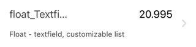

The `float` property can be changed in Appfigurate by allowing the user to select from a predefined list of valid choices. The user can customize the list adding by additional values using a `UITextField` between minimum and maximum values, and an optional regular expression validating input.

> Objective-C example

```objc
@interface Configuration : APLConfiguration
@property(nonatomic, assign) float forwardServerTime;
@end

@implementation Configuration
FLOAT_PROPERTY_LIST_EDIT(forwardServerTime, 0.0, 366.0, @"^(0?[0-9]?[0-9]|[1-2][0-9][0-9]|3[0-5][0-9]|36[0-5])?(?:\\.\\d+)?$", @"Forward server time (days)", @{@"7 days":@7.0,@"1 month":@30.0,@"1 Year":@365.0});
...
```

### double

`double` is an 8 byte floating point type with an approximate range of 2.3E-308 to 1.7E+308. The default value of a `double` is 0.0. You can change the default value of the property by assigning a new value in an overridden `reset` method.

`@property(assign) double propertyName;`

#### double slider implementation

`DOUBLE_PROPERTY_SLIDER(propertyName, minValue, maxValue, icon, description)`

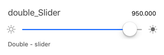

The `double` property can be changed in Appfigurate using a `UISlider` between minimum and maximum values. You can customize the minimum and maximum images using the icon parameter.

> Objective-C

```objc
@interface Configuration : APLConfiguration
@property(nonatomic, assign) double maxDecibel;
@end

@implementation Configuration
DOUBLE_PROPERTY_SLIDER(maxDecibel, 60.5, 120.41, APLIconSliderVolume, @"Clipping - decibels");
...
```

#### double editable implementation

`DOUBLE_PROPERTY_EDIT(propertyName, minValue, maxValue, regex, description)`

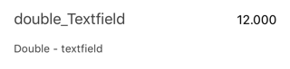

The `double` property can be changed in Appfigurate using a `UITextField` between minimum and maximum values, and an optional regular expression validating input.

> Objective-C

```objc
@interface Configuration : APLConfiguration
@property(nonatomic, assign) double shotAccuracy;
@end

@implementation Configuration
DOUBLE_PROPERTY_EDIT(shotAccuracy, -2.1, 4.1, @"", @"Shot accuracy");
...
```

#### double list implementation

`DOUBLE_PROPERTY_LIST(propertyName, description, ...)`

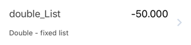

The `double` property can be changed in Appfigurate by allowing the user to select from a predefined list of valid choices.

> Objective-C

```objc
@interface Configuration : APLConfiguration
@property(nonatomic, assign) double rating;
@end

@implementation Configuration
DOUBLE_PROPERTY_LIST(rating, @"Quality rating", @{@"Low":@10.0,@"Average":@50.0,@"Excellent":@95.0});
...
```

#### double editable list implementation

`DOUBLE_PROPERTY_LIST_EDIT(propertyName, minValue, maxValue, regex, description, ...)`

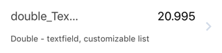

The `double` property can be changed in Appfigurate by allowing the user to select from a predefined list of valid choices. The user can customize the list adding by additional values using a `UITextField` between minimum and maximum values, and an optional regular expression validating input.

> Objective-C example

```objc
@interface Configuration : APLConfiguration
@property(nonatomic, assign) double forwardServerTime;
@end

@implementation Configuration
DOUBLE_PROPERTY_LIST_EDIT(forwardServerTime, 0.0, 366.0, @"^(0?[0-9]?[0-9]|[1-2][0-9][0-9]|3[0-5][0-9]|36[0-5])?(?:\\.\\d+)?$", @"Forward server time (days)", @{@"7 days":@7.0,@"1 month":@30.0,@"1 Year":@365.0});
...
```

### NSString

The default value of a `NSString` is nil. You can change the default value of the property by assigning a new value in an overridden `reset` method.

`@property(strong) NSString propertyName;`

#### NSString editable implementation

`STRING_PROPERTY_EDIT(propertyName, regex, description)`

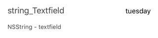

The `NSString` property can be changed in Appfigurate using a `UITextField` with an optional regular expression validating input.

> Objective-C example

```objc
@interface Configuration : APLConfiguration
@property(nonatomic, strong) NSString usernameOverride;
@end

@implementation Configuration
STRING_PROPERTY_EDIT(usernameOverride, @"", @"Overridden session username");
...
```

#### NSString list implementation

`STRING_PROPERTY_LIST(propertyName, description, ...)`

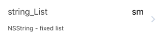

The `NSString` property can be changed in Appfigurate by allowing the user to select from a predefined list of valid choices.

> Objective-C example

```objc
@interface Configuration : APLConfiguration
@property(nonatomic, strong) NSString backgroundColorHex;
@end

@implementation Configuration
STRING_PROPERTY_LIST(backgroundColorHex, @"Color of background", @{@"LightGray":@"#d3d3d3", @"White":@"#ffffff", @"Beige":@"f5fcdc"});
...
```

#### NSString editable list implementation

`STRING_PROPERTY_LIST_EDIT(propertyName, regex, description, ...)`

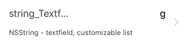

The `NSString` property can be changed in Appfigurate by allowing the user to select from a predefined list of valid choices. The user can customize the list adding by additional values using a `UITextField` between minimum and maximum values, and an optional regular expression validating input.

> Objective-C example

```objc
@interface Configuration : APLConfiguration
@property(nonatomic, strong) NSString foregroundColorHex;
@end

@implementation Configuration
STRING_PROPERTY_LIST_EDIT(foregroundColorHex, @"^#([a-f0-9]{6})$", @"Color of foreground", @{@"Black":@"#000000", @"MistyRose":@"#ffe4e1", @"LightBlue":@"add8e6"});
...
```

## UISlider icon types

### APLIconSliderSpeed

Tortise (minimum) and Hare (maximum) images

 ... 

### APLIconSliderCapacity

Battery empty (minimum) and Battery full (maximum) images

 ... 

### APLIconSliderNumeric

0 (minimum) and 1 (maximum) images

 ... 

### APLIconSliderBrightness

Dim (minimum) and Bright (maximum) images

 ... 

### APLIconSliderVolume

Low volume (minimum) and High volume (maximum) images

 ... 

## APLConfiguration overrides

### publicKey method

`- (NSData* _Nonnull) publicKey`

Override the `publicKey` method to return the public key for this app.
The Appfigurate app can export the correct public key for the app by:

1. Tap `≡ <your app name here>`.
2. Tap `Output .m implementation file`.
3. Choose your output method.
4. Copy and paste the publicKey method into your `APLConfiguration` subclass implementation. If you have both an iOS app and a watchOS app then you will need to return the correct public key from the method as in the following example:

> Objective-C example

```objc
- (NSString*) publicKey {
#if TARGET_OS_IOS
    return @"-----BEGIN PUBLIC KEY-----\n" \
        "MIIBIjANBgkqhkiG9w0BAQEFAAOCAQ8AMIIBCgKCAQEA5s2YXfKStHzgUEkY+KDm\n" \
        "yQUMO617+xo2tv5DF4M38emK7XpLR/ILLFiAiIHyRAdw9+wB80OEzek+bihwHWCs\n" \
        "WU0inAJ7gBLRqv7MHhPP4+XBbeizpLblPdBVVL1az5I3oDptpemIikAZrA37ZAH/\n" \
        "shk9C/wGogiQC4p60LmxbzI/+eYvI2x0M/Xxxpedcq6yRyHb+u+0ziNHoji5M6Qh\n" \
        "kcsailsMqANaN7VcO5NLPT3PzIc6WPG3iVJ0I8iCzXY/QNxOAtWc5t4CyB8+Z+fU\n" \
        "IEk9qAYiidZhpPb1gdJl4LN14qjBqYAmmJAo9oAabujlGmvxKQfR3Mj1FDd1GYab\n" \
        "6QIDAQAB\n" \
        "-----END PUBLIC KEY-----\n";
#elif TARGET_OS_WATCH
    return @"-----BEGIN PUBLIC KEY-----\n" \
        "MIIBIjANBgkqhkiG9w0BAQEFAAOCAQ8AMIIBCgKCAQEA5s2YXfKStHzgUEkY+KDm\n" \
        "yQUMO617+xo2tv5DF4M38emK7XpLR/ILLFiAiIHyRAdw9+wB80OEzek+bihwHWCs\n" \
        "WU0inAJ7gBLRqv7MHhPP4+XBbeizpLblPdBVVL1az5I3oDptpemIikAZrA37ZAH/\n" \
        "shk9C/wGogiQC4p60LmxbzI/+eYvI2x0M/Xxxpedcq6yRyHb+u+0ziNHoji5M6Qh\n" \
        "kcsailsMqANaN7VcO5NLPT3PzIc6WPG3iVJ0I8iCzXY/QNxOAtWc5t4CyB8+Z+fU\n" \
        "IEk9qAYiidZhpPb1gdJl4LN14qjBqYAmmJAo9oAabujlGmvxKQfR3Mj1FDd1GYab\n" \
        "6QIDAQAB\n" \
        "-----END PUBLIC KEY-----\n";
#endif
}
```

### allowInvalidSignatures method

`- (BOOL) allowInvalidSignatures`

Override if required. Return `YES` if invalid signatures are allowed to
apply configuration, or `NO` if only a correct signature is acceptable.

It is best practice to make release builds to only allow correct signatures.

The default implementation of `allowInvalidSignatures` is as follows:

- for Simulator builds, always returns `YES`.
- for Device builds, returns `YES` if the embedded entitlements file has `get-task-allow = true`, otherwise returns `NO`. (Release builds distributed through the App Store, Testflight, Ad Hoc or Enterprise will have `get-task-allow = false`).

> Objective-C example

```
- (BOOL) allowInvalidSignatures {
#if DEBUG
    return YES;
#else
    return NO;
#endif
}
```

### reset method

`- (void) reset`

Override if required to change the default values of the configuration object. You must ensure the default values meet minimum/maximum, list or regex value specifications for the property type.

> Objective-C example

```objc
- (void) reset
    self.decibelLimit = 5.1;
    self.foregroundColorHex = @"fa3bcc";
}
```

### customIdentifier method

`- (NSString* _Nullable) customIdentifier`

Available for iOS apps & app extensions only. watchOS uses the paired device's vendor identifier or custom identifier to target configuration.

By default Appfigurate uses the vendor identifier to target configuration to
a specific device. The vendor identifier is the result of:
`[[[UIDevice currentDevice] identifierForVendor] UUIDString]`

Instead of the vendor identifier, you may prefer to use an application 
specific custom identifier that you tie to a specific device. The default 
value of `customIdentifier` is `nil`.

> Objective-C example

```objc
- (NSString*) customIdentifier {
	return myAppRegistration.hardwareIdentity;
}
```