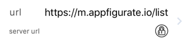

# Subclassing APLConfiguration - encrypted NSString

The default value of an encrypted `NSString` is nil. You can change the default value of the property by assigning a new plain text value in an overridden `reset` method.

`@property(strong) NSString propertyName;`

This page describes encrypted strings. Appfigurate also supports [plain textual strings](./SubclassingAPLConfiguration_plain_NSString.md).

#### NSString editable list implementation

`ENCRYPTED_STRING_PROPERTY_LIST_EDIT(propertyName, regex, description, ...)`



The `NSString` property can be changed in Appfigurate by allowing the user to select from a predefined list of valid choices. The user can customize the list adding by additional values using a `UITextField` and a regular expression validating input.

> Objective-C example

```objc
@interface Configuration : APLConfiguration
@property(nonatomic, strong) NSString url;
@end

@implementation Configuration

ENCRYPTED_STRING_PROPERTY_LIST_EDIT(url, @"https://[\\w\\.-]+\\.appfigurate.io/.*", @"url", @{@"Dev": ENCRYPTED_STRING_IOS_WATCHOS(@"https://dev.appfigurate.io/list",@"H7o9Lgqd4RgMJ...rtJQGh8DiiSAQ==",@""JaMa92a122zZs...Mnz23KamnZ0a="), @"Test": ENCRYPTED_STRING_IOS_WATCHOS(@"https://test.appfigurate.io/list",@"PL+UtWB9WHuO7...aX5BdNqEcbmQE=",@"Na1MSadBCaDD...KKANZias199Km=="), @"Prod": ENCRYPTED_STRING_IOS_WATCHOS(@"https://m.appfigurate.io/list",@"IxrJFFUarMg6p...E7OWYOC2uJ1AQ==",@"aZSDIMSaasiaM...8SKS1MMahfpIa=")});
...
```

#### `ENCRYPTED_STRING` macro

`ENCRYPTED_STRING(plaintext, ciphertext)`

For an iOS app where the `APLConfiguration` subclass has one public key use the `ENCRYPTED_STRING` macro for each list item in the `ENCRYPTED_STRING_PROPERTY_LIST_EDIT`.

The first parameter of the `ENCRYPTED_STRING` macro is the plain text, and will be used by `DEBUG` builds. The second parameter of the `ENCRYPTED_STRING` macro is the cipher text, and will be used by `RELEASE` builds. To generate the cipher text, use the included [String Encryption](./StringEncryptionUtility.md) macOS utility.

> Objective-C example

```objc
ENCRYPTED_STRING_PROPERTY_LIST_EDIT(url, @"https://[\\w\\.-]+\\.appfigurate.io/.*", @"url", @{@"Dev":ENCRYPTED_STRING(@"https://dev.appfigurate.io/list",@"H7o9Lgqd4RgMJ...rtJQGh8DiiSAQ=="), @"Test":ENCRYPTED_STRING(@"https://test.appfigurate.io/list",@"PL+UtWB9WHuO7...aX5BdNqEcbmQE="), @"Prod":ENCRYPTED_STRING(@"https://m.appfigurate.io/list",@"IxrJFFUarMg6p...E7OWYOC2uJ1AQ==")});
```

#### `ENCRYPTED_STRING_IOS_WATCHOS` macro

`ENCRYPTED_STRING_IOS_WATCHOS(plaintext, ciphertextIOS, ciphertextWatchOS)`

For an iOS and watchOS app where the `APLConfiguration` subclass has two public keys, use the `ENCRYPTED_STRING_IOS_WATCHOS` macro for each list item in the `ENCRYPTED_STRING_PROPERTY_LIST_EDIT` macro. 

The first parameter of the `ENCRYPTED_STRING` macro is the plain text, and will be used by `DEBUG` builds. The second and third parameters of the `ENCRYPTED_STRING` macro are the cipher text for iOS and watchOS apps, and will be used by `RELEASE` builds. To generate the cipher text, use the included [String Encryption](./StringEncryptionUtility.md) macOS utility.

> Objective-C example

```objc
ENCRYPTED_STRING_PROPERTY_LIST_EDIT(url, @"https://[\\w\\.-]+\\.appfigurate.io/.*", @"url", @{@"Dev": ENCRYPTED_STRING_IOS_WATCHOS(@"https://dev.appfigurate.io/list",@"H7o9Lgqd4RgMJ...rtJQGh8DiiSAQ==",@""JaMa92a122zZs...Mnz23KamnZ0a="), @"Test": ENCRYPTED_STRING_IOS_WATCHOS(@"https://test.appfigurate.io/list",@"PL+UtWB9WHuO7...aX5BdNqEcbmQE=",@"Na1MSadBCaDD...KKANZias199Km=="), @"Prod": ENCRYPTED_STRING_IOS_WATCHOS(@"https://m.appfigurate.io/list",@"IxrJFFUarMg6p...E7OWYOC2uJ1AQ==",@"aZSDIMSaasiaM...8SKS1MMahfpIa=")});
```

#### Encryption best practice

Using the `ENCRYPTED_STRING` and `ENCRYPTED_STRING_IOS_WATCHOS` macros guarantees that the plain text of the list item values will not be included in the resulting application binary, only the cipher text. The cipher text can only be decrypted by Appfigurate using the correct private key.

You can verify that the plain text is not included in the `RELEASE` application binary using the macOS `strings` tool as follows:

> Terminal

```csh
> cd ~/Library/Developer/Xcode/DerivedData/AppfigurateWorkspace-esajjxyazigjunfteipthjfiobut/Build/Products/Release-iphoneos/AppfigurateExample (iOS).app
> strings AppfigurateExample | grep "https://dev.appfigurate.io/list"     // no results
> strings AppfigurateExample | grep "H7o9Lgqd4RgMJ...rtJQGh8DiiSAQ=="     // prints H7o9Lgqd4RgMJ...rtJQGh8DiiSAQ==
```

It is best practice to use the `ENCRYPTED_STRING` and `ENCRYPTED_STRING_IOS_WATCHOS` macros to encrypt sensitive information such as server urls (e.g. internal test environments), rather than expose them as plain text.
