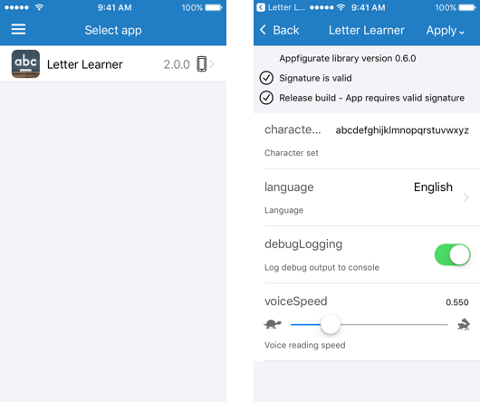
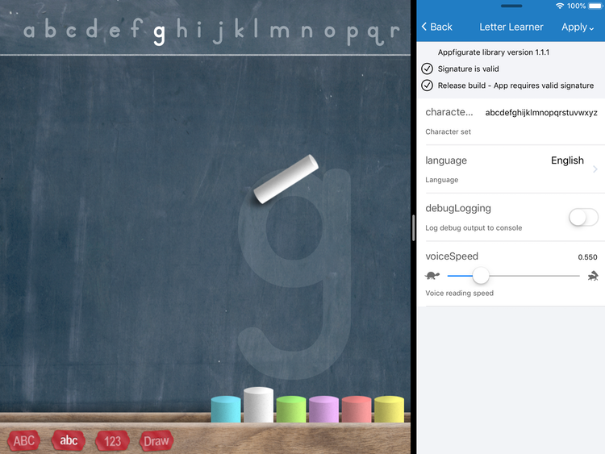

# Appfigurate™
 
Appfigurate is a suite of tools for iOS and watchOS developers and testers, that allow you to securely configure your apps and app extensions at runtime. Appfigurate increases your efficiency by removing the edit/compile/deploy cycle when you need to make configuration changes. Appfigurate consists of:

* Appfigurate app - both a Simulator and an App Store build - to allow you to configure your apps at runtime
* Appfigurate library - a tiny static library to embed into your apps
* Examples
* Documentation

### iPhone

### iPad multitasking

## Features

Feature                                 | Appfigurate Simulator | Appfigurate App Store
--------------------------------------- | --------------------- | ---------------------
Compatible with Xcode 8 and Xcode 9 |  | 
Configure iOS 8.0+ apps |  | 
Configure iOS 8.0+ app extensions |  | 
Configure watchOS 2.0+ apps |  | 
Configure watchOS 3.0+ app extensions | available soon | available soon
Configure iOS UI automation tests |  | 
Supports iPad multitasking |  | 
Apply configuration locally |  | 
Apply configuration remotely (via SMS/Email) |  | 
Your apps metadata shared across all Simulators |  |
Your apps metadata securely stored on each Device |  | 
Unlock Appfigurate with PIN/TouchID/FaceID |   | 

## Installating Appfigurate app

Clone the Appfigurate repository using the terminal command:

>git clone https://github.com/electricbolt/appfiguratesdk.git

### Simulator build
To install the Appfigurate Simulator app into your iOS Simulator, open `AppfigurateWorkspace.xcworkspace` in Xcode 8 or above, ensure `Appfigurate` is selected in the Scheme popup, choose your Simulator device e.g. `iPhone SE` and run.

### Device build
-The Appfigurate Simulator app in this repository cannot be installed onto iOS devices. You should install the iOS device build from the [App Store](https://itunes.apple.com/us/app/appfigurate/id1332575368?ls=1&mt=8) instead.

## Integrate Appfigurate library

Follow the [Quick Start Guide](./Documentation/QuickStartGuide.md) to integrate Appfigurate library into your own apps.

## Further documentation

[Subclassing APLConfiguration](./Documentation/SubclassingAPLConfiguration.md) - methods to override in your APLConfiguration subclass.

[Security and export compliance](./Documentation/SecurityExportCompliance.md) - best practices.

[Advanced configuration](./Documentation/AdvancedConfiguration.md) - Info.plist options and app startup.

[Additional library functions](./Documentation/AdditionalFunctions.md) - listening for configuration changes.

[Displaying overridden configuration](./Documentation/OverriddenConfiguration.md) - in your iOS app.

[Automation testing configuration](./Documentation/AutomationTestingConfiguration.md) - how to setup.
